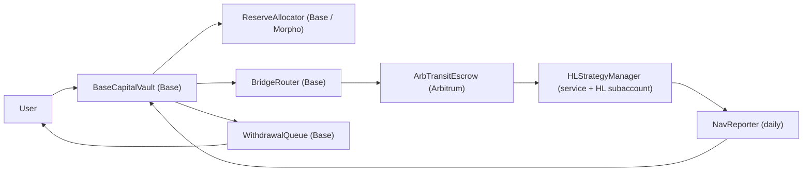

# Base -> Arbitrum -> Hyperliquid Vault Build Spec

## Goal

Build an ETH-denominated vault system where:

- users deposit ETH on Base
- shares are minted on Base
- idle capital can earn reserve yield
- active capital can bridge to Arbitrum and fund a Hyperliquid strategy account
- daily NAV is settled back to Base so shares always price off one source of truth

This is the v1 architecture for replacing the current "fund the bot wallet" model with a real share-backed capital stack.

## V1 Principles

- Base is the ownership and share-accounting layer.
- The vault is ETH-denominated from the user's perspective.
- Hyperliquid is a strategy sleeve, not a separate user balance system.
- Users do not set arbitrary per-wallet sliders in one pooled vault.
- v1 uses preset tranches, each with a fixed target allocation model.
- Reserve yield is conservative and liquid-first.
- Daily NAV settlement is the canonical accounting update cadence.

## Non-Goals

- No direct user funding of Hyperliquid subaccounts.
- No freeform per-user capital routing inside one shared pool.
- No full "Base contract talks to HL with zero offchain service" assumption in v1.
- No Octant integration in the reserve path for v1.

Octant can be added later as a treasury/performance-fee destination, not as the reserve allocator.

## High-Level Architecture



## Asset Model

### User-Facing Denomination

The vault is ETH-denominated.

- deposits arrive as `ETH`
- vault wraps to `WETH` for accounting and integrations
- shares represent a claim on total ETH-denominated vault NAV

### Internal Buckets

Vault assets are tracked across four buckets:

- `liquidAssets`
  - WETH immediately available for redemptions and operating buffer
- `reserveAssets`
  - WETH or ETH-correlated reserve strategy assets
- `pendingBridgeAssets`
  - capital in transit between Base and Arbitrum
- `hlStrategyAssets`
  - Hyperliquid strategy equity, converted into ETH terms during NAV settlement

### Hyperliquid Conversion Rule

Hyperliquid strategy capital is USD-denominated in practice.

For v1:

- Base vault allocates `WETH`
- bridge/execution rail converts the allocated amount into `USDC`
- USDC is deposited into Hyperliquid
- daily NAV converts strategy equity back into ETH terms for vault accounting

This preserves ETH-denominated user shares while still using Hyperliquid the way it actually works.

## Tranche Model

v1 uses preset tranches instead of arbitrary sliders.

Recommended tranches:

### Reserve

- `70% reserve`
- `20% liquid`
- `10% HL`

### Balanced

- `40% reserve`
- `20% liquid`
- `40% HL`

### Aggro

- `15% reserve`
- `15% liquid`
- `70% HL`

### Why presets instead of sliders

One pooled vault cannot cleanly support different wallet-level allocation preferences without becoming either:

- separate vaults anyway, or
- a bookkeeping nightmare

v1 implementation choice:

- one vault contract implementation
- multiple vault instances, one per tranche
- same interface, different policy parameters

UI can still render these as "sliders", but they snap to the preset tranche profiles.

## Contracts and Modules

## 1. BaseCapitalVault

Base chain. ERC-4626-style vault, ETH-denominated via WETH accounting.

### Responsibilities

- accept ETH deposits
- wrap ETH to WETH
- mint shares
- track aggregate NAV buckets
- expose share price and vault state
- authorize allocators/routers/reporters

### Core Interface

```solidity
interface IBaseCapitalVault {
    function depositETH(address receiver) external payable returns (uint256 shares);
    function requestWithdraw(uint256 shares, address receiver) external returns (uint256 requestId);
    function redeemInstant(uint256 shares, address receiver) external returns (uint256 assetsOut);

    function totalAssets() external view returns (uint256);
    function liquidAssets() external view returns (uint256);
    function reserveAssets() external view returns (uint256);
    function pendingBridgeAssets() external view returns (uint256);
    function hlStrategyAssets() external view returns (uint256);

    function sharePriceE18() external view returns (uint256);
    function trancheId() external view returns (bytes32);

    function allocateToReserve(uint256 assets) external;
    function deallocateFromReserve(uint256 assets) external;
    function markBridgeOut(uint256 assets, bytes32 routeId) external;
    function markBridgeIn(uint256 assets, bytes32 routeId) external;
    function markStrategyIncrease(uint256 assets, bytes32 settlementId) external;
    function markStrategyDecrease(uint256 assets, bytes32 settlementId) external;

    function settleDailyNav(
        uint256 strategyAssetsEth,
        uint256 reserveAssetsEth,
        uint256 pendingBridgeEth,
        uint256 feesEth,
        bytes32 navHash
    ) external;
}
```

### State Variables

```solidity
address public owner;
address public allocator;
address public navReporter;
address public withdrawalQueue;
address public weth;

bytes32 public trancheId;
uint16 public performanceFeeBps;
uint16 public reserveTargetBps;
uint16 public liquidTargetBps;
uint16 public hlTargetBps;

uint256 public totalShares;
uint256 public liquidAssetsStored;
uint256 public reserveAssetsStored;
uint256 public pendingBridgeAssetsStored;
uint256 public hlStrategyAssetsStored;
uint256 public accruedFeesEth;

uint256 public lastNavTimestamp;
bytes32 public lastNavHash;

mapping(address => uint256) public shareBalance;
```

### Events

```solidity
event Deposited(address indexed user, uint256 assets, uint256 shares);
event WithdrawRequested(address indexed user, uint256 indexed requestId, uint256 shares, uint256 assetsEstimate);
event WithdrawInstant(address indexed user, uint256 shares, uint256 assetsOut);
event ReserveAllocated(uint256 assets);
event ReserveDeallocated(uint256 assets);
event BridgeOutMarked(bytes32 indexed routeId, uint256 assets);
event BridgeInMarked(bytes32 indexed routeId, uint256 assets);
event DailyNavSettled(uint256 totalAssets, uint256 sharePriceE18, bytes32 navHash);
```

## 2. WithdrawalQueue

Base chain. Handles queued exits when liquid assets are insufficient.

### Responsibilities

- hold queued withdrawal requests
- lock shares until fulfillment
- fulfill requests as liquidity returns
- support partial fulfillment if desired

### Core Interface

```solidity
interface IWithdrawalQueue {
    function enqueue(address owner, uint256 shares, address receiver) external returns (uint256 requestId);
    function fulfill(uint256 requestId, uint256 assetsOut) external;
    function cancel(uint256 requestId) external;
    function getRequest(uint256 requestId) external view returns (
        address owner,
        address receiver,
        uint256 shares,
        uint256 assetsRequested,
        uint256 assetsFulfilled,
        bool finalized
    );
}
```

### State Variables

```solidity
struct WithdrawRequest {
    address owner;
    address receiver;
    uint256 shares;
    uint256 assetsRequested;
    uint256 assetsFulfilled;
    uint64 createdAt;
    bool finalized;
}

uint256 public nextRequestId;
mapping(uint256 => WithdrawRequest) public requests;
uint256[] public pendingIds;
```

## 3. ReserveAllocator

Base chain. Deploys idle capital into reserve yield.

### Responsibilities

- move vault capital into Morpho reserve strategy
- pull reserve capital back when withdrawals or HL allocation need liquidity
- report reserve asset balances in ETH terms

### V1 Implementation

- first implementation should be `MorphoReserveAllocator`
- strategy asset should remain ETH-correlated where practical
- if a suitable ETH-correlated Morpho market is unavailable, keep reserve allocation conservative and explicit

### Core Interface

```solidity
interface IReserveAllocator {
    function deposit(uint256 assets) external returns (uint256 sharesOut);
    function withdraw(uint256 assets, address receiver) external returns (uint256 assetsOut);
    function totalManagedAssets() external view returns (uint256);
    function liquidatableAssets() external view returns (uint256);
}
```

### State Variables

```solidity
address public vault;
address public underlyingAsset;
address public targetVaultOrMarket;
uint256 public totalPrincipal;
uint256 public lastReportedAssets;
```

## 4. BridgeRouter

Base chain. Initiates cross-chain movement from the vault.

### Responsibilities

- receive allocation instructions from the vault/allocator
- lock and route bridge capital out
- track bridge route ids and statuses
- prevent double-counting while assets are in transit

### Core Interface

```solidity
interface IBridgeRouter {
    function bridgeToArbitrum(uint256 assets, bytes32 intentId) external returns (bytes32 routeId);
    function markFailedRoute(bytes32 routeId) external;
    function getRoute(bytes32 routeId) external view returns (
        uint256 assets,
        uint64 createdAt,
        uint8 status
    );
}
```

### State Variables

```solidity
enum RouteStatus { None, Pending, ReceivedOnArb, DepositedToHl, Returned, Failed }

struct Route {
    uint256 assets;
    uint64 createdAt;
    RouteStatus status;
}

address public vault;
address public bridgeExecutor;
mapping(bytes32 => Route) public routes;
```

## 5. ArbTransitEscrow

Arbitrum chain. Temporary custody layer for bridged funds.

### Responsibilities

- receive bridged capital
- stage capital before HL deposit
- receive HL withdrawals before return bridge
- provide a clean audit point for transit balances

### Core Interface

```solidity
interface IArbTransitEscrow {
    function receiveBridge(bytes32 routeId, uint256 assets) external;
    function releaseToStrategy(bytes32 routeId, uint256 assets, address receiver) external;
    function receiveFromStrategy(bytes32 routeId, uint256 assets) external;
    function releaseToBridge(bytes32 routeId, uint256 assets, address receiver) external;
}
```

### State Variables

```solidity
address public bridgeExecutor;
address public strategyManager;
mapping(bytes32 => uint256) public routeBalances;
```

## 6. HLStrategyManager

Offchain service plus dedicated Hyperliquid subaccount.

### Responsibilities

- receive strategy capital from Arbitrum transit
- convert to HL-compatible funding asset if needed
- deposit to HL
- manage spot/perp transfers
- place/cancel orders
- withdraw back to Arbitrum when de-risking or honoring queue demand

### Note

This is not a single onchain contract in v1. It is a controlled execution service around a dedicated HL subaccount or vault.

### Service Interface

```ts
interface HLStrategyManager {
  depositToHl(routeId: string, usdcAmount: bigint): Promise<string>;
  withdrawFromHl(routeId: string, usdcAmount: bigint): Promise<string>;
  transferSpotToPerp(amount: bigint): Promise<string>;
  placeOrder(params: OrderIntent): Promise<string>;
  closeAllPositions(): Promise<string[]>;
  fetchEquityUsd(): Promise<number>;
  fetchOpenPositions(): Promise<HlPosition[]>;
}
```

### Strategy State

```ts
type StrategyState = {
  hlAccount: string;
  currentEquityUsd: number;
  pendingDepositsUsd: number;
  pendingWithdrawalsUsd: number;
  openRiskUsd: number;
  lastNavTimestamp: number;
};
```

## 7. NavReporter

Base-side settlement entrypoint plus offchain signer/report job.

### Responsibilities

- collect reserve balance
- collect pending bridge balance
- collect HL strategy equity
- convert strategy equity into ETH terms
- settle one daily NAV update into the vault

### Core Interface

```solidity
interface INavReporter {
    function reportNav(
        uint256 strategyAssetsEth,
        uint256 reserveAssetsEth,
        uint256 pendingBridgeEth,
        uint256 feesEth,
        bytes32 navHash
    ) external;
}
```

### State Variables

```solidity
address public vault;
address public reporterSigner;
uint256 public lastReportTimestamp;
bytes32 public lastReportHash;
```

## Deposit Lifecycle

### ETH Deposit

1. User calls `depositETH(receiver)` on `BaseCapitalVault`.
2. Vault wraps ETH to WETH.
3. Vault mints tranche shares to `receiver`.
4. Assets land in `liquidAssets`.
5. Allocation keeper later rebalances toward tranche targets.

### Reserve Allocation

1. Keeper checks current bucket weights against tranche targets.
2. If `reserveAssets < reserveTarget`, vault allocates from `liquidAssets`.
3. `ReserveAllocator` deposits capital into Morpho reserve strategy.
4. Vault records increase in `reserveAssets`.

### HL Allocation

1. Keeper checks current HL allocation deficit.
2. Vault marks `pendingBridgeAssets += amount`.
3. `BridgeRouter` initiates Base -> Arbitrum route.
4. `ArbTransitEscrow` receives funds.
5. `HLStrategyManager` moves funds into HL.
6. Daily NAV later reflects strategy equity in ETH terms.

## Withdraw Lifecycle

### Instant Withdraw

1. User calls `redeemInstant(shares, receiver)`.
2. Vault checks `liquidAssets >= assetsOut`.
3. Shares burn immediately.
4. WETH unwraps to ETH if needed.
5. ETH transfers to receiver.

### Queued Withdraw

1. User calls `requestWithdraw(shares, receiver)`.
2. Shares are locked into `WithdrawalQueue`.
3. Keeper deallocates reserve assets or initiates HL unwind if needed.
4. When liquid assets return, queue fulfills in FIFO order.
5. Receiver gets ETH on Base.

## Keeper Jobs

## 1. Allocation Keeper

Frequency:

- every 15 minutes

Responsibilities:

- compare actual bucket weights vs target tranche weights
- push excess liquid into reserve
- pull from reserve if liquid buffer too low
- initiate bridge routes when HL sleeve is underweight

## 2. Bridge Completion Keeper

Frequency:

- every 1 to 5 minutes

Responsibilities:

- confirm Base -> Arbitrum routes
- mark `pending -> received`
- release Arbitrum transit balances to HL strategy
- mark return routes on unwind

## 3. HL Risk Keeper

Frequency:

- every 1 minute

Responsibilities:

- watch HL positions and equity
- enforce strategy risk limits
- trigger de-risk / close-all when withdrawal pressure or circuit-breakers hit

## 4. Daily NAV Keeper

Frequency:

- once per day at fixed UTC time

Responsibilities:

- read reserve assets
- read pending bridge balances
- read HL equity
- convert USD sleeve to ETH terms
- settle one canonical NAV update to Base

## 5. Withdrawal Fulfillment Keeper

Frequency:

- every 5 minutes

Responsibilities:

- examine queue depth
- fulfill queued withdrawals from liquid assets
- request reserve deallocation or strategy unwind if liquidity is short

## NAV Math

Vault shares price off ETH-denominated total assets.

### Core Formula

```txt
totalAssetsEth =
    liquidAssetsEth
  + reserveAssetsEth
  + pendingBridgeAssetsEth
  + hlStrategyAssetsEth
  - accruedFeesEth
```

### Share Price

```txt
sharePriceE18 = totalAssetsEth / totalShares
```

Use virtual assets / virtual shares at initialization to avoid first-depositor inflation attacks.

### Hyperliquid Sleeve Conversion

Since HL equity is USD-native:

```txt
hlStrategyAssetsEth = hlEquityUsd / ethUsdPrice
```

For v1, `ethUsdPrice` should come from a robust daily oracle source and be snapshotted with the NAV report.

### Fees

v1 recommended fee model:

- no management fee
- performance fee only on realized positive strategy PnL

Performance fee accrual:

```txt
realizedProfitEth = max(0, strategyReturnEth - strategyPrincipalEth)
feeEth = realizedProfitEth * performanceFeeBps / 10_000
```

## Risk and Accounting Rules

- only tranche-level allocators can move capital between buckets
- vault must never treat pending bridge assets and received strategy assets as simultaneously live
- queue claims must lock shares before fulfillment
- NAV updates must be monotonic in timestamp
- if HL is unreachable, the last settled NAV remains canonical until next report
- if bridge assets are stuck, they remain in `pendingBridgeAssets`

## Recommended V1 Permissions

- `owner`
  - upgrades, emergency pause, role rotation
- `allocator`
  - reserve / bridge rebalancing
- `navReporter`
  - daily NAV settlement only
- `riskGuardian`
  - pause bridge or HL allocation during incidents

## Suggested Deployment Layout

### Base

- `BaseCapitalVault_Reserve`
- `BaseCapitalVault_Balanced`
- `BaseCapitalVault_Aggro`
- `WithdrawalQueue`
- `MorphoReserveAllocator`
- `BridgeRouter`
- `NavReporter`

### Arbitrum

- `ArbTransitEscrow`

### Hyperliquid

- one dedicated HL subaccount per tranche, or
- one shared HL strategy account per vault if you want simpler v1 ops

Per-tranche HL accounts are cleaner for accounting.

## V1 Implementation Order

1. `BaseCapitalVault`
2. `WithdrawalQueue`
3. `MorphoReserveAllocator`
4. `BridgeRouter`
5. `ArbTransitEscrow`
6. `HLStrategyManager`
7. `NavReporter`
8. tranche UI

## Open Design Decisions

### 1. One HL account per tranche vs one shared HL account

Recommended:

- one HL account per tranche

Reason:

- cleaner NAV
- cleaner fee attribution
- fewer cross-subsidy edge cases

### 2. ETH-correlated reserve vs stablecoin reserve

Recommended:

- keep user shares ETH-denominated
- keep reserve sleeve as ETH-correlated where possible
- only convert to USDC at the HL allocation boundary

### 3. Per-wallet sliders

Recommended:

- no freeform sliders in v1
- presets only

Reason:

- pooled accounting stays sane
- UI still feels expressive
- implementation risk stays low

## Post-V1 Extensions

- HyperEVM executor path
- onchain cross-chain messaging instead of thinner relayer logic
- per-tranche public risk dashboards
- Octant/performance-fee public-goods routing
- tranche reallocation governance
