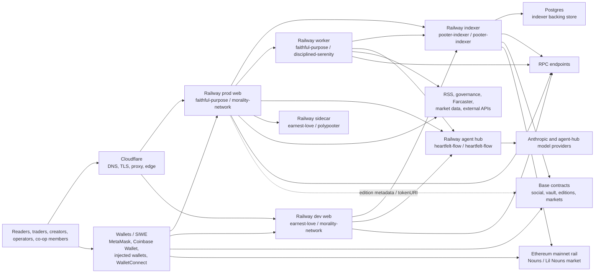
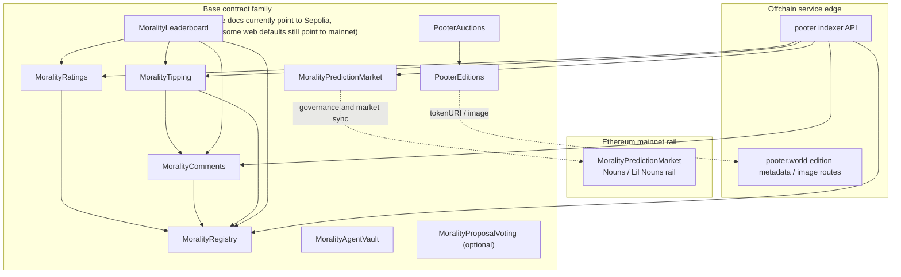

# Morality Co-operative Limited

## pooter.world System Architecture Report

Prepared for co-operative members  
Date: April 1, 2026

This report is based on direct inspection of the active `morality.network-master` codebase, Railway service bindings, and public DNS and HTTP routing observed on April 1, 2026. [docs/DEPLOYMENTS.md](./DEPLOYMENTS.md) remains the operational source of truth for domains, deploy commands, and environment ownership.

## Executive Summary

- Public traffic for `pooter.world` and `dev.pooter.world` now flows through Cloudflare to Railway. Vercel is no longer the live hosting model for the public web product.
- The launch stack is composed of five meaningful runtime planes: public web, durable indexer/API, background worker, agent hub, and a feature-specific Polymarket sidecar.
- Onchain state remains the only canonical write layer. The indexer is the durable read layer. The web app is a presentation and orchestration layer and should not be treated as the system of record.
- The strongest architectural improvement since the Vercel-era layout is workload separation. User-facing pages, long-running worker loops, indexing, and model routing are no longer forced through one request lifecycle.
- The biggest remaining weakness is operational sprawl. Multiple Railway services overlap or appear partially legacy, which makes it easy for operators and AI agents to target the wrong service.
- Chain posture is still mixed. Current deployment docs treat Base Sepolia as the active core-contract environment, while parts of the web app still default to Base mainnet addresses and Ethereum mainnet remains in scope for the Nouns prediction rail. That mismatch must be resolved before claiming fully aligned production readiness.
- Remaining file-backed archives in the web app should be treated as transitional persistence, not the long-term durability model.
- Operating cost is now more sensitive to Railway service count, Postgres footprint, and AI usage than to frontend function duration. The clearest cost win is consolidation of duplicate services.

## Scope

### Included

- `web`: Next.js application, API routes, cron-triggered endpoints, edition metadata, miniapp surfaces
- `indexer`: Ponder ingestion, query API, scanner persistence, Postgres-backed read layer
- `contracts`: Solidity protocol contracts, deployment scripts, broadcast artifacts
- Railway runtime topology for the production and development pooter surfaces
- Agent and worker services that directly support pooter.world

### Excluded From Launch-Critical Scope

- `spirited-flexibility` and other `noun.wtf` infrastructure
- Historical root prototypes and archived experiments that are not part of the active pooter deployment path
- Any local-only `.vercel` metadata, which is already gitignored and not a production artifact

## Current Runtime Topology

### Launch-Critical Services

| Runtime plane | Current target | Public URL | Role | Canonical state |
| --- | --- | --- | --- | --- |
| Public web (prod) | `faithful-purpose / production / morality-network` | `https://pooter.world` | User-facing Next.js app, SSR, API routes, auth, metadata, orchestration | No |
| Public web (dev) | `earnest-love / dev / morality-network` | `https://dev.pooter.world` | Development and preview frontend | No |
| Durable read layer | `pooter-indexer / production / pooter-indexer` | `https://pooter-indexer-production.up.railway.app` | Event indexing, denormalized reads, archive and scanner backing APIs | No, but intended canonical offchain cache |
| Background execution | `faithful-purpose / production / disciplined-serenity` | internal / non-user-facing | Scheduled jobs, scanners, trading and coordination loops | No |
| Agent hub | `heartfelt-flow / production / heartfelt-flow` | `https://heartfelt-flow-production-d872.up.railway.app` | LLM routing and provider abstraction | No |
| Market sidecar | `earnest-love / production / polypooter` | `https://polypooter-production.up.railway.app` | Polymarket arb and market-specific sidecar logic | No |
| Onchain contracts | Base Sepolia, Base mainnet defaults in app config, Ethereum mainnet market rail | chain-native | Canonical identity, comments, tipping, prediction settlement, editions, vault rail | Yes |

### Overlap And Cleanup Candidates

| Service | Observed role | Relation to pooter.world | Recommended action |
| --- | --- | --- | --- |
| `earnest-love / production / morality-network` | Older Railway frontend | Not the current public production host | Archive or relabel clearly |
| `pooter-indexer / production / pooter-worker` | Worker-style trading and scanner activity | Overlaps the canonical worker role | Merge into one worker plan or archive |
| `pooter-indexer / production / pooter-agent-worker` | Worker-style agent and trading activity | Overlaps the canonical worker role | Merge into one worker plan or archive |
| `pooter-indexer / production / pooter1` | Dedicated agent/editorial service | Supports pooter features but is not core web hosting | Keep only if intentionally owned and documented |
| `faithful-purpose / production / radiant-liberation` | Appears to be duplicate `pooter1`-style service and unhealthy | Confusing extra runtime | Repair with explicit ownership or archive |
| `spirited-flexibility` | User-confirmed `noun.wtf` infrastructure | Not part of `pooter.world` | Leave out of pooter runbooks |

### Public Edge

- DNS is on Cloudflare nameservers.
- `pooter.world` and `dev.pooter.world` both terminate at `railway-edge`.
- `dev.pooter.world` currently CNAMEs to `svb92msz.up.railway.app`.
- Cloudflare should be treated as the public edge and Railway as the serving platform.

## System Overview

| Layer | Primary technology | Runtime or host | Canonical state |
| --- | --- | --- | --- |
| Public web | TypeScript, Next.js 16, React 19, Tailwind 4 | Railway behind Cloudflare | No |
| Background execution | TypeScript Node services | Railway worker services | No |
| Durable read layer | Ponder, Hono, Postgres, viem | Railway indexer service plus Postgres | No, but intended offchain source of truth |
| LLM orchestration | Hono/Node service with provider routing | Railway agent hub | No |
| Sidecar agents | TypeScript/Node feature services | Railway sidecars | No |
| Smart contracts | Solidity 0.8.24, Foundry, OpenZeppelin upgradeable | Base and Ethereum | Yes |
| Browser wallet integration | wagmi, viem, RainbowKit, SIWE | User browser | No |
| Optional extension | TypeScript Chrome extension | Browser runtime | No |
| Legacy prototype stack | C# / .NET 4.5.2 | Historical only | No |

## Full Network Diagram

## Onchain Contract Topology

The contract family is broader than a simple ratings app. It already covers registry, social features, treasury-like flows, editions, prediction markets, and the vault rail. Exact addresses should be read from [docs/DEPLOYMENTS.md](./DEPLOYMENTS.md) and the broadcast artifacts, not inferred from stale defaults.

| Contract family | Primary role | Current posture |
| --- | --- | --- |
| `MoralityRegistry` | Entity registration and ownership claims | Documented in the current Base Sepolia deploy set |
| `MoralityRatings` | Structured ratings and reason storage | Documented in the current Base Sepolia deploy set |
| `MoralityComments` | Threaded onchain discussion and votes | Documented in the current Base Sepolia deploy set |
| `MoralityTipping` | Entity and comment tipping plus withdrawals | Documented in the current Base Sepolia deploy set |
| `MoralityLeaderboard` | Reputation and composite score surfaces | Documented in the current Base Sepolia deploy set |
| `MoralityPredictionMarket` | Prediction market settlement | Base Sepolia in current deploy docs; Ethereum mainnet remains part of the Nouns market architecture |
| `MoralityAgentVault` | Agent-managed vault and vault rail entrypoint | Documented in current deploy docs; rail rollout is coordinated separately |
| `PooterEditions` | ERC-721 editions with metadata served by pooter.world | Documented in current deploy docs |
| `PooterAuctions` | Auction layer for editions | Documented as separate rollout from `DeployAll.s.sol` |
| `MoralityProposalVoting` | Optional governance voting layer | Not part of the default current deploy set |

## Product Surface Inventory

| Route or surface | Functional role | Main dependencies | Main write path |
| --- | --- | --- | --- |
| `/` | Streaming front page and mixed editorial feed | Feeds, archive, editorials, indexer, AI surfaces | Archive and editorial generation flows |
| `/leaderboard` | Universal reputation and analyst ranking | Onchain contracts, indexer, derived scoring | Primarily read-only |
| `/discuss` | Onchain discussion rooms | Base contract reads | Onchain comment and vote transactions |
| `/proposals` | DAO and governance aggregation | Snapshot, Tally, governance feeds | None by default |
| `/predictions` | Nouns and Lil Nouns market surface | Ethereum rail, governance proposal data | Onchain prediction market transactions |
| `/markets` | Agent market dashboard | Worker outputs, market data, vault data, narratives | Operator-triggered workflows and read-heavy dashboarding |
| `/signals` | Signal and commentary surface | Trading engine, sentiment and market data | Internal operator workflows only |
| `/sentiment` | Morality Index and topic sentiment | Feed corpus, market data, AI scoring | Derived offchain state |
| `/archive` | Long-term article archive | Stored article and editorial artifacts | Archive persistence and reads |
| `/bots` | Agent telemetry and operator console | Worker, bus, scanner, agent APIs | System and operator actions |
| `/nouns/[id]` and marketplace surfaces | Nouns pages, listing, fill, and cancel flows | Ethereum NFT data, Seaport/OpenSea, indexer proxies | Typed order creation and order-state sync |
| Chrome extension | Inline contextual rating and tipping UI | Shared contract config and onchain reads | Onchain ratings, tips, comments |

## Languages, Frameworks, And Runtime Boundaries

| Component | Languages | Frameworks and libraries | Runtime notes |
| --- | --- | --- | --- |
| `web` | TypeScript, CSS | Next.js, React, Tailwind, wagmi, viem, RainbowKit | SSR app plus API surface; should stay thin |
| `indexer` | TypeScript | Ponder, Hono, viem | Always-on or semi-persistent service; durable read layer |
| `contracts` | Solidity | Foundry, OpenZeppelin upgradeable | Canonical onchain state |
| `agent hub` | TypeScript | Hono and provider adapters | Centralized LLM abstraction |
| Worker and sidecars | TypeScript | Node services, trading and scanner logic | Long-running background execution |
| `extension` | TypeScript | Chrome extension runtime | Optional client surface |

## Data Stores And Persistence Boundaries

| Store | Technology | Current purpose | Risk level |
| --- | --- | --- | --- |
| Contract state | EVM storage | Canonical identity, social actions, markets, vault state, editions | Low |
| Indexer database | Postgres | Query acceleration, denormalized events, scanner and archive backing | Medium until chain config is fully aligned |
| `web/src/data/article-archive.json` | Local JSON in repo and app tree | Article archive bootstrap and persistence | Medium-high if treated as primary production store |
| `web/src/data/editorial-archive.json` | Local JSON in repo and app tree | Editorial archive bootstrap and persistence | Medium-high if treated as primary production store |
| `web/src/data/score-history.json` | Local JSON in repo and app tree | Historical scoring snapshots | Medium if not checkpointed elsewhere |
| In-memory worker and bus state | Process memory | Coordinator, scanner, relay, transient state | High unless checkpointed to indexer or DB |
| Session and secrets | Env plus cookies | SIWE session scaffolding and operator auth | Medium until hardening is completed |

## Provider And Dependency Matrix

| Provider or dependency | Status | Role in architecture | Notes |
| --- | --- | --- | --- |
| Cloudflare | Confirmed | DNS, proxy, TLS, public edge | Public domains route through `railway-edge` |
| Railway | Confirmed | Hosts web, worker, indexer, agent hub, and sidecars | Main serving platform |
| Postgres | Confirmed | Durable indexer backing store | Lives in the `pooter-indexer` project |
| Anthropic | Confirmed | Editorial and scoring workloads | Should remain budgeted and queued |
| Agent-hub model providers | Confirmed at service level | Fallback and model routing behind the agent hub | Keep provider selection centralized |
| Snapshot, Tally, and governance feeds | Confirmed | Governance ingestion | Read-heavy external dependencies |
| Neynar and Farcaster | Optional but present | Social and feed ingestion | Feature dependency, not canonical state |
| CoinGecko, DexScreener, and Hyperliquid | Confirmed | Markets and trading context | Degrade gracefully on failure |
| Cloudflare Browser Rendering | Optional | Crawl and extraction backend | Useful but not launch-critical |
| OpenSea and Seaport | Confirmed in Nouns marketplace flows | Listing, fill, and cancel order lifecycle | Approval surfaces should be explicit to users |

## Architecture Observations

### What Is Strong

- Public web, long-running worker logic, indexing, and LLM routing are separated by service instead of collapsed into one request lifecycle.
- The onchain protocol layer is richer than a content site: registry, comments, tipping, prediction rails, editions, and vault infrastructure form a coherent base.
- Cloudflare plus Railway is simpler to reason about than the previous split mental model where Vercel, Railway, and sidecars blurred together.
- The indexer pattern is the right durability model for a product that reads more often than it writes.

### What Is Fragile

- Railway project sprawl is still too high. Multiple services overlap, and the naming does not clearly signal which service is canonical.
- Chain configuration remains split between documented Base Sepolia deploys and mainnet-oriented defaults in parts of the web app.
- Some important content archives still sit in the web tree instead of being treated as first-class durable data.
- Scheduler ownership is easy to lose track of unless one document explicitly names the active jobs and platform configuration.
- SIWE/auth and secret hygiene still need hardening before the system should be described as fully production-hardened.

## Operating Cost Model

These estimates are directional. They describe the cost drivers created by the current architecture, not a billing export.

| Cost center | What drives spend now | Best control lever |
| --- | --- | --- |
| Cloudflare edge | Usually low for DNS, proxy, and TLS alone | Keep advanced add-ons minimal unless needed |
| Prod and dev web services | Railway service uptime, memory, build and runtime usage | Sleep or downsize dev when unused |
| Indexer plus Postgres | Always-on compute, storage, and backfill volume | Keep one durable read layer and avoid duplicate data stores |
| Background workers | Number of always-on worker services | Collapse overlapping workers into one canonical service |
| Agent hub and sidecars | Always-on service count plus model traffic | Keep only feature-critical sidecars live |
| AI inference | Editorial volume and model selection | Use cheaper models for scoring and classification; reserve premium models for long-form output |
| Onchain gas | Deployment, upgrades, trades, tips, and claims | Batch non-urgent operations and separate dev from prod wallets |

### Scenario View

| Scenario | Assumptions | Monthly profile |
| --- | --- | --- |
| Lean launch | Prod web, one worker, one indexer/Postgres pair, dev sleeping, moderate AI | Low hundreds USD or below before gas |
| Current observed footprint | Prod web, dev web, worker, indexer/Postgres, agent hub, Polypooter, moderate AI | Low-to-mid hundreds USD before gas |
| Sprawled footprint | Current footprint plus duplicate legacy workers and services left running | Higher spend with limited additional user value |

The most valuable cost-cutting move is not a cheaper model or a smaller web instance. It is eliminating duplicate always-on services that do nearly the same job.

## Risks And Immediate Remediation

| Priority | Risk | Why it matters | Recommended action |
| --- | --- | --- | --- |
| P0 | Runtime ambiguity across Railway projects | Operators and agents can deploy to or inspect the wrong service | Publish a single canonical service map and archive duplicate services |
| P0 | Chain-environment drift | Users can hit a UI that implies the wrong network or contract addresses | Align docs, env defaults, and indexer config around one declared production chain |
| P0 | File-backed production archives | Web-local JSON is a weak primary durability model | Move archives and score history into Postgres or object storage with explicit recovery flow |
| P0 | Secrets and wallet hygiene | Earlier repo state included risky secret handling patterns | Re-rotate anything previously exposed and keep secrets only in managed env stores |
| P1 | Incomplete session and auth hardening | Signature verification alone is not the same as robust production session management | Finish SIWE session issuance, expiry, rotation, and operator scope rules |
| P1 | Scheduler drift | Jobs can keep running without repo truth or silently stop after platform changes | Treat `docs/DEPLOYMENTS.md` as the schedule source of truth and document the active scheduler owner |
| P1 | Duplicate agent and worker services | Extra services raise cost and debugging complexity | Assign explicit ownership or shut them down |
| P2 | Sidecar proliferation | Feature-specific services can become accidental critical dependencies | Mark each sidecar as critical, optional, or experimental in docs and envs |

## Recommended Target Architecture

1. Keep onchain contracts as the only canonical write layer for user identity, social state, markets, and vault settlement.
2. Keep the Railway prod web service thin: render pages, authenticate users, proxy durable reads, and orchestrate workflows.
3. Standardize on one canonical worker service for scanners, scheduled jobs, and trading loops.
4. Treat the indexer and Postgres as the one durable offchain read and cache system, not one of several competing stores.
5. Keep the agent hub centralized so model selection, fallback, and budget policy live in one place.
6. Document sidecars explicitly. If a service is optional, say so; if it is legacy, archive it.
7. Separate dev and prod by hostname, wallet, env, and scheduler ownership so dev can never accidentally behave like prod.
8. Preserve Cloudflare as the public edge and Railway as the serving plane until there is a strong reason to add more infrastructure layers.

## Conclusion

pooter.world is now much closer to a legible operating model than it was under the old Vercel-era mental model. The core architecture is understandable: Cloudflare at the edge, Railway for service hosting, an indexer for durable reads, workers for long-running jobs, and onchain contracts as the only source of truth.

The remaining work is mostly organizational rather than conceptual. The system needs one canonical map of live services, one declared production chain posture, and one durable offchain persistence strategy. Once those are locked, the platform becomes easier to operate, cheaper to explain, and far harder for humans or agents to mis-target.

## Appendix A: Evidence Base

Primary repo locations and runtime observations used for this report:

- `docs/DEPLOYMENTS.md`
- `README.md`
- `web/package.json`
- `web/src/lib/contracts.ts`
- `web/src/lib/server/onchain-clients.ts`
- `web/src/lib/archive.ts`
- `web/src/lib/editorial-archive.ts`
- `web/src/lib/narrative-extractor.ts`
- `web/src/app/api/newsroom/route.ts`
- `web/src/app/api/cron/daily-edition/route.ts`
- `web/src/app/api/cron/daily-illustration/route.ts`
- `web/src/app/api/v1/marketplace/orders/[[...slug]]/route.ts`
- `web/src/hooks/useSeaport.ts`
- `indexer/ponder.config.ts`
- `indexer/ponder.schema.ts`
- `indexer/src/api/routes.ts`
- `contracts/script/DeployAll.s.sol`
- `contracts/script/DeployVaultRailBase.s.sol`
- `contracts/script/DeployVaultRailArb.s.sol`
- `contracts/broadcast/DeployAll.s.sol/84532/run-latest.json`
- Railway service links, domains, and health/routes checked on April 1, 2026
- Public DNS and HTTP headers for `pooter.world` and `dev.pooter.world` checked on April 1, 2026

## Appendix B: Documentation Governance

- [docs/DEPLOYMENTS.md](./DEPLOYMENTS.md) is the operational source of truth for deploy targets, hostnames, and cron schedule.
- Host-specific scheduler config should live in the active deployment platform, not in checked-in legacy platform files.
- Local `.vercel/` metadata remains gitignored and is not part of the production architecture.

## Appendix C: Pricing Sources

- Railway pricing: <https://railway.com/pricing>
- Anthropic API pricing: <https://www.anthropic.com/pricing#api>
- Cloudflare Browser Rendering pricing: <https://developers.cloudflare.com/browser-rendering/platform/pricing/>
