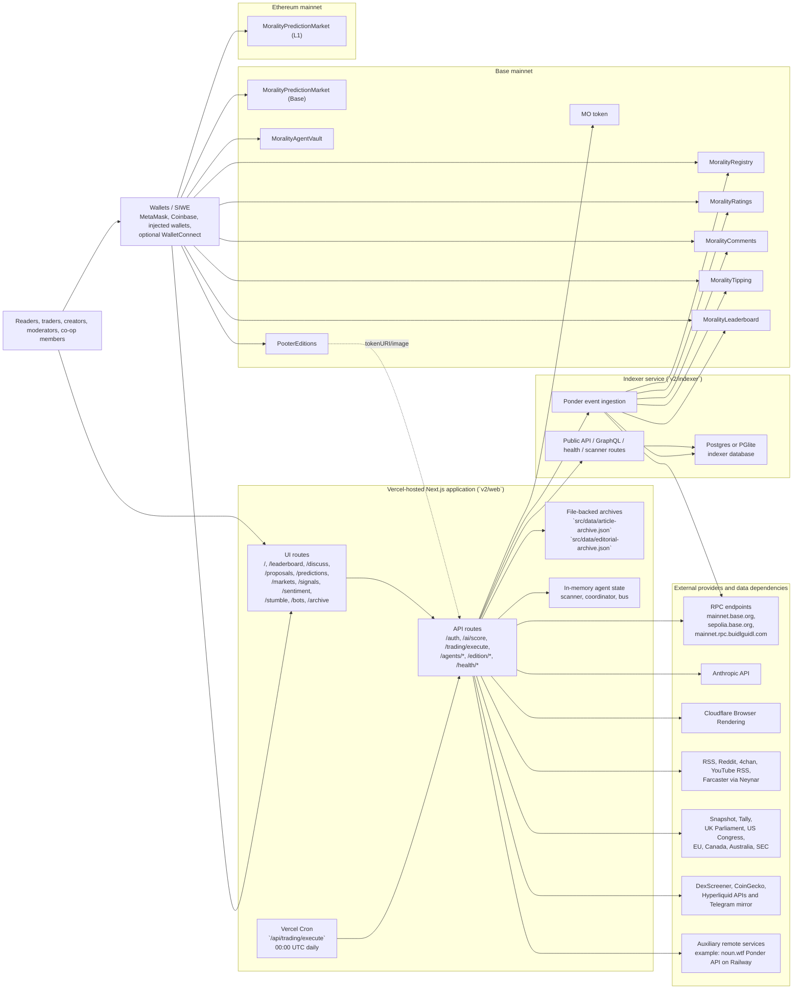
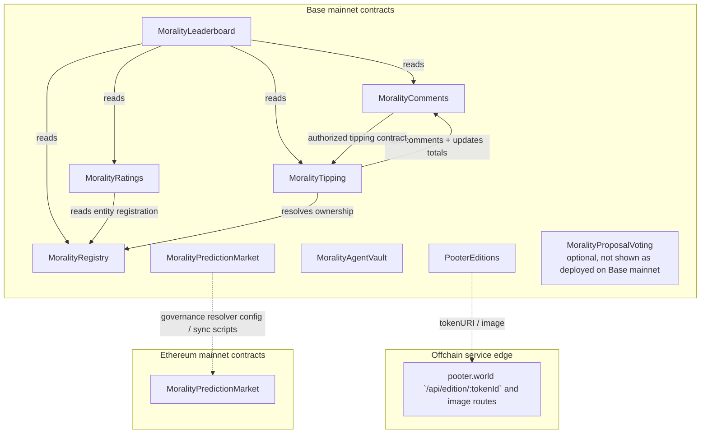

# Morality Co-operative Limited

## pooter world System Architecture Report

Prepared for co-operative members  
Date: March 12, 2026

This report is based on direct inspection of the active `v2/` codebase and official vendor pricing pages checked on March 12, 2026.

## Executive Summary

- The live launch stack is the `v2/` system, not the legacy repo root. The active production surfaces are `v2/web`, `v2/indexer`, and `v2/contracts`, with `v2/extension` as an optional adjacent client.
- pooter world is a hybrid system: onchain state lives on Base and Ethereum mainnet, while the user-facing product, ingestion, AI pipelines, and query acceleration live offchain in TypeScript services.
- Base mainnet is the operational social layer: registry, ratings, comments, tipping, leaderboard, agent vault, and NFT editions all default there. Ethereum mainnet is reserved for the trust-minimized Nouns and Lil Nouns prediction market.
- The web application is not only a frontend. It is also an API layer, cron runner, metadata host for editions, feed aggregator, AI orchestration layer, and part of the data persistence path.
- The indexer is the intended durable query layer, but the checked-in Ponder config still defaults to Base Sepolia while the web defaults to Base mainnet. That environment split is the most important architecture mismatch in the repo.
- Durability is currently fragmented across three classes of storage: onchain contract state, indexer database state, and web-local JSON files or in-memory stores. This increases operational risk and makes serverless hosting less reliable than it appears.
- Immediate operational issues exist: committed environment files containing live-looking secrets, a committed deployer private-key file, and a Sign-In With Ethereum flow that verifies signatures but does not yet establish a hardened production session.
- Practical recurring operating cost is likely in the low two-digit to low three-digit USD range per month before gas, depending on whether the indexer is always-on, how many seats are on Vercel or Railway, and how heavily Anthropic models are used.

## Scope

### Included

- `v2/web`: Next.js application, API routes, feeds, miniapps, AI workflows, edition metadata, cron entrypoints
- `v2/indexer`: Ponder event indexer, query API, scanner persistence, Postgres or PGlite storage
- `v2/contracts`: Solidity contracts, Foundry scripts, Base and Ethereum deployments
- `v2/extension`: optional Chrome extension surface for inline onchain interactions

### Excluded From Production Scope

- Root `README.md` describes Morality 1.0 as a playground in .NET 4.5.2 and not the final launch architecture.
- Historical directories such as `morality.network.contracts-master`, `ratings-main`, and old Chrome extension prototypes should be treated as legacy research or archived prototypes, not launch-critical infrastructure.

## System Overview

| Layer | Primary technology | Runtime or host | Canonical state |
| --- | --- | --- | --- |
| Web product and API | TypeScript, React 19.2.3, Next.js 16.1.6, Tailwind 4 | Vercel is explicitly configured | No, except some ad hoc file-backed caches and archives |
| Indexer and query API | TypeScript, Ponder, Hono, viem | Any Node host; local Docker and Postgres are provided | No, but intended as the main offchain query layer |
| Smart contracts | Solidity 0.8.24, Foundry, OpenZeppelin upgradeable | Base mainnet, Base Sepolia, Ethereum mainnet | Yes for registry, social, treasury, and market state |
| Browser wallet integration | wagmi, viem, RainbowKit, SIWE | User browser | No |
| Optional extension | TypeScript Chrome extension | Chrome runtime | No |
| Legacy prototype stack | C# / .NET 4.5.2 | Legacy local app only | No |

## Full Network Diagram

## Onchain Contract Topology

## Smart Contract Inventory

### Base Mainnet

| Contract | Role | Proxy address | Implementation address |
| --- | --- | --- | --- |
| MoralityRegistry | Universal entity registry and canonical claim system | `0x2ea7502C4db5B8cfB329d8a9866EB6705b036608` | `0x68d72ee14cb657f17ba4a1e23c77444b1fbd677e` |
| MoralityRatings | 1-5 ratings plus structured reasons | `0x29F66D8b15326cE7232c0277DBc2CbFDaaf93405` | `0xb61be51e8aed1360eaa03eb673f74d66ec4898d7` |
| MoralityComments | Threaded comments, argument types, voting | `0x66BA3cE1280bF86DFe957B52e9888A1De7F81d7b` | `0x622cd30124e24dffe77c29921bd7622e30d57f8b` |
| MoralityTipping | Entity and comment tipping, escrow withdrawals | `0x27c79A57BE68EB62c9C6bB19875dB76D33FD099B` | `0x57dc0c9833a124fe39193dc6a554e0ff37606202` |
| MoralityLeaderboard | Composite score with AI oracle hook | `0x29f0235d74E09536f0b7dF9C6529De17B8aF5Fc6` | `0x1c73efffeb89ad8699770921dbd860bb5da5b15a` |
| MoralityPredictionMarket | Base-side prediction market deployment | `0x71b2e273727385c617fe254f4fb14a36a679b12a` | `0x14a361454edcb477644eb82bf540a26e1cead72a` |
| MoralityAgentVault | Managed ETH vault for trading agents | `0x4b48d35e019129bb5a16920adc4cb7f445ec8ca5` | `0xf5bc0775ce478df8477781017d67809d663d9995` |
| PooterEditions | ERC-721 editions with metadata served by pooter.world | `0x06d7c7d70c685d58686ff6e0b0db388209fccc6e` | `0x98855cc7c85d563194d8e42b57d9cf35d5446286` |

### Ethereum Mainnet

| Contract | Role | Proxy address | Implementation address |
| --- | --- | --- | --- |
| MoralityPredictionMarket | Trust-minimized Nouns and Lil Nouns proposal market | `0x2ea7502C4db5B8cfB329d8a9866EB6705b036608` | `0x68d72ee14cb657f17ba4a1e23c77444b1fbd677e` |

### Important Note

The checked-in deploy scripts and broadcast artifacts show active Base mainnet and Ethereum mainnet deployments, but `v2/indexer/ponder.config.ts` still defaults to Base Sepolia addresses. Production indexer configuration should be reconciled before presenting this architecture as fully aligned.

## Miniapp and Product Surface Inventory

| Route or surface | Functional role | Main reads | Main writes |
| --- | --- | --- | --- |
| `/` | Streaming front page and mixed feed | RSS, governance feeds, Farcaster, archive, AI-derived content | article archive JSON, editorial archive JSON |
| `/leaderboard` | Universal reputation ledger | RSS aggregation, governance activity, analyst reputation, interpretation scores | mostly read-only |
| `/discuss` | Onchain discussion rooms | Base comments and votes | Base comment and vote transactions |
| `/proposals` | DAO, parliamentary, and governance aggregator | Snapshot, Tally, onchain governors, parliamentary APIs, SEC feeds, Hyperliquid governance | none by default |
| `/predictions` | Nouns and Lil Nouns ETH prediction markets | Ethereum mainnet market, governance proposals | Ethereum mainnet staking and claim transactions |
| `/markets` | Agent market dashboard | trading engine, agent vault data, market feeds | operator-triggered trading actions |
| `/signals` | AI and market signal surface | trading engine, sentiment and market data | none or internal operator flows |
| `/sentiment` | Morality Index and topic sentiment | market data, feed corpus, event corpus, AI scoring | derived offchain state |
| `/stumble` | Randomized discovery and archive resurfacing | feed archive and live feed | none |
| `/bots` | Internal agent telemetry console | `/api/agents`, `/api/agents/scanner`, `/api/agents/bus` | operator and system-level agent actions |
| `/archive` | Long-term article archive | archived feed items, archived editorials | archive reads; currently file-backed |
| Chrome extension | Inline contextual rating and tipping UI on arbitrary websites | onchain reads plus shared contracts config | onchain ratings, comments, tips, votes |

## Languages, Frameworks, and Runtime Boundaries

| Component | Languages | Frameworks and libraries | Runtime notes |
| --- | --- | --- | --- |
| `v2/web` | TypeScript, CSS, a small amount of shell and Node scripts | Next.js 16.1.6, React 19.2.3, Tailwind 4, wagmi, viem, RainbowKit, Anthropic SDK | Runs as a server-rendered web app plus API layer |
| `v2/indexer` | TypeScript | Ponder, Hono, viem | Long-running or semi-persistent Node service, better suited to always-on hosting |
| `v2/contracts` | Solidity 0.8.24 | Foundry, OpenZeppelin upgradeable UUPS stack | Deployed on EVM chains |
| `v2/extension` | TypeScript, browser APIs | Chrome extension runtime | Optional client surface, not required for launch |
| Legacy root | C# | .NET 4.5.2 | Historical prototype only |

## Data Stores and Persistence Boundaries

| Data store | Technology | Current purpose | Risk level |
| --- | --- | --- | --- |
| Contract state on Base and Ethereum | EVM storage | canonical social state, prediction markets, vaults, NFTs | low, assuming audited deployment and key control |
| Indexer database | Postgres or PGlite | query acceleration, denormalized events, scanner persistence | medium until production chain config is aligned |
| `article-archive.json` | local JSON file in web app | persistent article archive | high on serverless hosting; local disk is not a durable database |
| `editorial-archive.json` | local JSON file in web app | persistent AI editorial archive | high on serverless hosting; same durability issue |
| In-memory agent stores | Node memory | scanner launches, bus state, coordinator state | high; process restarts lose history unless proxied to indexer |
| Session cookie config | cookie plus env secret | SIWE session scaffolding | medium; verify route does not yet fully establish hardened sessions |

## Hosting and Provider Matrix

| Provider or dependency | Status in architecture | Evidence in code | Notes |
| --- | --- | --- | --- |
| Vercel | confirmed | `v2/web/vercel.json` | Hosts the Next.js app and runs a daily cron hitting `/api/trading/execute` |
| Postgres | confirmed as supported | `v2/indexer/docker-compose.yml`, `v2/indexer/ponder.config.ts` | Local compose included; production host is not explicitly documented |
| PGlite | confirmed fallback | `v2/indexer/ponder.config.ts` | Useful for local development, not ideal for serious production analytics |
| Base public RPC | confirmed | `v2/web/src/lib/server/onchain-clients.ts` | Default fallback is `https://mainnet.base.org` |
| Ethereum public RPC | confirmed | `v2/web/src/lib/server/onchain-clients.ts` | Default fallback is `https://mainnet.rpc.buidlguidl.com` |
| Anthropic | confirmed | `v2/web/src/app/api/ai/score/route.ts`, `v2/web/src/lib/claude-editorial.ts`, `v2/web/src/lib/daily-edition.ts` | Used for scoring, editorials, daily editions, and digesting |
| Cloudflare Browser Rendering | confirmed optional | `v2/web/src/lib/cloudflare-crawl.ts` | Used as an optional crawl and extraction backend |
| Neynar / Farcaster | confirmed optional | `v2/web/src/lib/farcaster.ts` | Farcaster feed ingestion depends on API access |
| Snapshot and Tally | confirmed | `v2/web/src/lib/governance.ts`, `v2/web/src/app/api/health/sources/route.ts` | Governance aggregation depends on these APIs |
| DexScreener and CoinGecko | confirmed | `v2/indexer/src/api/routes.ts`, `v2/web/src/app/api/markets/route.ts` | Market pricing and token-launch enrichment |
| Hyperliquid APIs and Telegram mirror | confirmed | `v2/web/src/lib/governance.ts`, trading engine | Used for markets and governance-style feeds |
| Railway-hosted auxiliary API | confirmed for Nouns description fallback | `v2/web/src/lib/nouns.ts` | The code references a Railway-hosted Ponder API for Nouns descriptions |

## Architecture Observations

### What Is Strong

- The product is already split along sensible boundaries: web UI, event indexer, and smart contracts.
- The contract suite is richer than a simple rating app. It includes registry, argumentation, tipping, leaderboard, markets, vault, and editions as a coherent protocol layer.
- The web app has already evolved into a multi-surface product rather than a single page application, which makes it suitable for launch storytelling and future modularization.
- Offchain services are mostly written in TypeScript, which keeps the staffing model simple for a small technical team.

### What Is Fragile

- Production and staging chain configuration are not aligned. The web defaults to Base mainnet while the checked-in indexer config points to Base Sepolia.
- The web tier is persisting important content to local JSON files inside the app tree. That is not robust on serverless or immutable deployments.
- Some agent state is only in process memory unless a scanner backend URL is supplied, which means restarts can silently drop useful operational data.
- Sign-In With Ethereum is only partially productionized. The verify route validates the signature and returns the address, but the code comments still say a proper session or JWT should be created in production.

## Ongoing Infrastructure Cost Model

### Pricing Inputs Checked On March 12, 2026

| Line item | Pricing input | Why it matters here |
| --- | --- | --- |
| Vercel Pro | starts at `$20/user/month` | likely host for `v2/web`, server rendering, API routes, cron |
| Railway | Hobby `$5/month`; Pro `$20/seat/month`; usage-based CPU, RAM, and volume billing | plausible managed host for always-on indexer or auxiliary APIs |
| Railway usage rates | `$0.0000134/vCPU-second`, `$0.00000386/GB-second`, `$0.00000006/GB-second` for volume | useful for modeling an always-on indexer and database |
| Anthropic API | Sonnet 4/4.5 and 3.7: `$3/MTok input`, `$15/MTok output`; Haiku 4.5: `$1/MTok input`, `$5/MTok output` | editorials, scoring, daily edition generation, digesting |
| Cloudflare Browser Rendering | first `10 hours/month` included on paid plans, then `$0.09/hour` | only relevant if crawl and extraction are used heavily |
| Base and Ethereum gas | variable, not fixed monthly | deploys, upgrades, resolution, tipping, comments, trading, claims |

Farcaster ingestion via Neynar is visible in the codebase, but Neynar pricing was not included in the modeled totals because the exact plan tier in use could not be confirmed from the production configuration or re-verified from a public pricing source during this audit.

### Practical Monthly Scenarios

These are directional operating estimates, not invoices. They are based on repo behavior and simple usage assumptions.

| Scenario | Assumptions | Estimated monthly total |
| --- | --- | --- |
| Lean demo or pilot | 1 Vercel seat, public RPC, light Anthropic usage, no always-on managed indexer | roughly `$26-$40` plus gas |
| Managed launch baseline | 1 Vercel seat, small always-on indexer or API worker, small Postgres footprint, light-to-moderate Anthropic usage | roughly `$40-$75` plus gas |
| Small team operating mode | 2+ Vercel seats, medium always-on indexer footprint, more frequent Anthropic generation, some Cloudflare overage | roughly `$75-$130+` plus gas |

### Resource Math For A Small Always-On Indexer

Using Railway's published usage pricing, a continuously running service at approximately `0.25 vCPU`, `0.5 GB RAM`, and `5 GB` of volume works out to roughly:

- CPU: about `$8.68/month`
- RAM: about `$5.00/month`
- Volume: about `$0.78/month`
- Total resource usage: about `$14.46/month`, before any Railway base plan or seat charges

At approximately `0.5 vCPU`, `1 GB RAM`, and `10 GB` of volume, the same service is about `$28.93/month` before plan or seat charges.

### AI Cost Sensitivity

- A single daily long-form Sonnet editorial at roughly `30k` input tokens and `8k` output tokens is about `$6.30/month`.
- Lightweight daily scoring or classification at roughly `100k` input tokens and `20k` output tokens on Haiku 4.5 is about `$6.00/month`.
- AI costs remain modest if Sonnet is reserved for long-form synthesis and cheaper models handle classification, scoring, and refresh jobs.

## Where Costs Can Be Reduced

1. Consolidate web-local JSON archives and scanner persistence into the indexer database. This removes fragile serverless disk writes and avoids paying for two different durability patterns.
2. Use a model tiering policy: Haiku for scoring, tagging, and lightweight synthesis; Sonnet only for the editorial surfaces that members actually read.
3. Move long-running agent loops and scanner polling out of the Vercel request lifecycle and into a small always-on worker. This reduces timeouts, duplicate work, and serverless unpredictability.
4. Keep public RPC endpoints for low-traffic launch periods, but only introduce paid RPC once rate limits or reliability become a measured bottleneck.
5. Cache slow third-party governance and market API responses more aggressively at the indexer or API layer so repeated reads do not fan out into dozens of vendor calls.
6. If the Chrome extension is not in the initial launch scope, avoid treating it as a first-wave operational dependency.

## Risks and Immediate Remediation

### Priority 0

- Rotate any secrets present in `v2/web/.env.local` and remove them from tracked or shared environments.
- Rotate the deployer key referenced by `v2/contracts/.env` and move deployment secrets into a proper secret manager.

### Priority 1

- Align the indexer from Base Sepolia to the same production chain and contract addresses used by the web application.
- Replace file-backed production archives with Postgres-backed tables or an object-storage plus manifest pattern.
- Finish the SIWE session flow so authentication creates a real signed session rather than only returning an address after verification.

### Priority 2

- Publish one explicit production deployment document naming the actual host for web, indexer, database, cron, and any worker services.
- Separate "launch-critical" services from "nice-to-have" experiments such as scanner bus telemetry, so members can see what must be funded first.
- Add chain-environment labels everywhere: Base mainnet, Base Sepolia, Ethereum mainnet, and any future test deployments.

## Recommended Target Architecture After Hardening

1. Keep smart contracts as the canonical settlement and reputation layer.
2. Keep the Next.js app as the public web surface and thin orchestration layer.
3. Move all durable offchain data into a single managed Postgres-backed indexer or data service.
4. Use a small always-on worker for scanner polling, agent coordination, daily editions, and other scheduled jobs.
5. Treat AI as a metered utility behind explicit queues, budgets, and model selection rules.
6. Document a clean split between production, staging, and experimental features.

## Conclusion

pooter world is already more than a website. It is a mixed architecture composed of an onchain reputation protocol, a media and governance ingestion system, AI-assisted editorial and scoring workflows, and a growing family of miniapps around discussion, prediction, discovery, and market telemetry.

The architecture is credible for launch, but it should not yet be presented as fully production-hardened without three fixes: secret rotation, chain-environment alignment, and consolidation of offchain persistence into a durable database-backed service.

Once those are addressed, the system becomes easier to explain, cheaper to operate, and safer to scale.

## Appendix A: Evidence Base

Primary code locations inspected for this report:

- `v2/web/package.json`
- `v2/web/vercel.json`
- `v2/web/src/lib/contracts.ts`
- `v2/web/src/lib/server/onchain-clients.ts`
- `v2/web/src/app/api/auth/verify/route.ts`
- `v2/web/src/lib/session.ts`
- `v2/web/src/lib/archive.ts`
- `v2/web/src/lib/editorial-archive.ts`
- `v2/web/src/app/api/agents/scanner/route.ts`
- `v2/web/src/app/api/trading/execute/route.ts`
- `v2/web/src/lib/governance.ts`
- `v2/web/src/lib/farcaster.ts`
- `v2/web/src/lib/cloudflare-crawl.ts`
- `v2/web/src/lib/nouns.ts`
- `v2/indexer/ponder.config.ts`
- `v2/indexer/ponder.schema.ts`
- `v2/indexer/src/api/routes.ts`
- `v2/indexer/docker-compose.yml`
- `v2/contracts/src/*.sol`
- `v2/contracts/script/DeployAll.s.sol`
- `v2/contracts/script/DeployPredictionMarketL1.s.sol`
- `v2/contracts/broadcast/DeployAll.s.sol/8453/run-latest.json`
- `v2/contracts/broadcast/DeployPredictionMarketL1.s.sol/1/run-latest.json`

## Appendix B: Reusable Technical Prompt

Use the following prompt if a refreshed architecture report is needed later:

> Produce a board-grade technical architecture report for Morality Co-operative Limited covering the live pooter world production system. Inspect the active `v2/` codebase only unless explicitly told otherwise, and distinguish clearly between confirmed production architecture, staging configuration, legacy code, and inferred components. Include:
>
> 1. an executive summary written for technically literate non-engineers,
> 2. a full system context diagram showing users, browser clients, wallets, web app, API routes, cron jobs, indexer services, databases, smart contracts, RPC endpoints, AI providers, governance providers, market-data providers, and any auxiliary worker services,
> 3. a dedicated onchain contract topology diagram listing every deployed contract, chain, proxy, implementation, upgrade pattern, and major dependency edge,
> 4. a complete inventory of miniapps, routes, APIs, storage layers, and languages or frameworks used by each subsystem,
> 5. a hosting and provider matrix naming which services are confirmed versus inferred,
> 6. a monthly infrastructure cost model with explicit assumptions, vendor links, and opportunities to reduce cost without materially reducing launch capability,
> 7. a risk register covering secrets management, staging versus production mismatches, data durability, auth hardening, observability gaps, and operational single points of failure,
> 8. a recommended target-state architecture and prioritized remediation plan.
>
> Format the report in polished Markdown with tables and Mermaid diagrams. Use exact dates, cite official pricing pages, avoid hype, and write so that a new senior engineer could use the document to understand the system quickly.

## Appendix C: Pricing Sources

- Vercel pricing: <https://vercel.com/pricing>
- Railway pricing: <https://railway.com/pricing>
- Anthropic API pricing: <https://www.anthropic.com/pricing#api>
- Cloudflare Browser Rendering pricing: <https://developers.cloudflare.com/browser-rendering/platform/pricing/>
